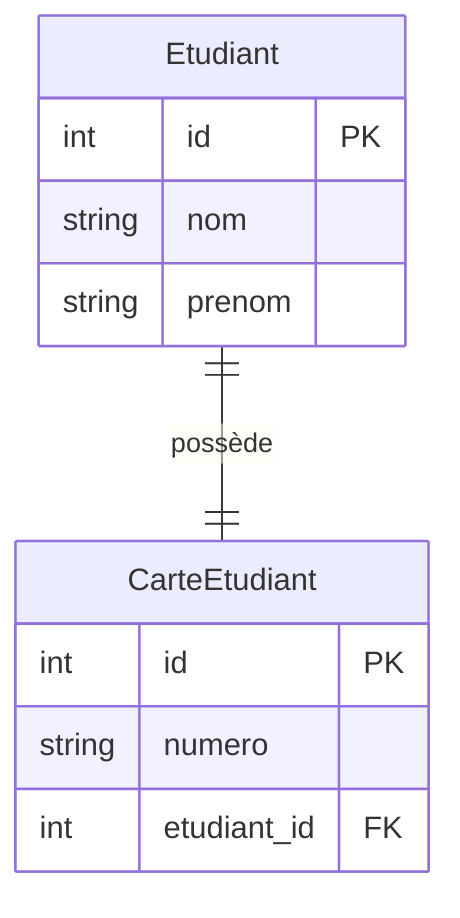

# <h1 id="projet-etudiant-carte">Travail à faire : Créer une application relationnelle Étudiant ↔ Carte Étudiant</h1>

## Objectif du projet

Vous allez construire **par vous-même** une petite application complète en Python en utilisant :

* **SQLAlchemy** pour créer deux modèles liés par une relation **1:1**
* **PySide6 + Qt Designer** pour concevoir l’interface graphique
* **SQLite** comme base de données locale


## Contexte du projet

Un **étudiant** possède **une seule carte étudiante**.
Une **carte étudiante** est **associée à un seul étudiant**.

Vous devez modéliser cette situation avec **deux tables** SQLAlchemy :

1. `Etudiant` : nom, prénom
2. `CarteEtudiant` : numéro de carte, référence vers l'étudiant


## Objectifs pédagogiques

* Créer deux classes Python (modèles ORM) liées par une **relation un-à-un (1:1)**
* Comprendre comment modéliser une clé étrangère avec `unique=True`
* Connecter une interface PySide6 à ces modèles
* Enregistrer et afficher les données dans une base SQLite


## Ce que vous devez faire (étapes obligatoires)

> Reproduisez toutes les étapes suivantes **dans un projet propre et fonctionnel**.

### Étape 1 – Créer un dossier de projet

Nom du dossier recommandé :

```
etudiant_carte_project
```


### Étape 2 – Créer et activer un environnement virtuel

Dans votre terminal :

```bash
python -m venv env
.\env\Scripts\activate
```


### Étape 3 – Installer les dépendances

Toujours dans le terminal :

```bash
pip install sqlalchemy pyside6
```


### Étape 4 – Créer les modèles relationnels SQLAlchemy

Dans un fichier **`database.py`**, vous devez :

1. Définir les deux classes suivantes :

```python
class Etudiant(Base):
    id = ...
    nom = ...
    prenom = ...
    carte = relationship(..., uselist=False)

class CarteEtudiant(Base):
    id = ...
    numero = ...
    etudiant_id = Column(..., ForeignKey(...), unique=True)
    etudiant = relationship(...)
```

2. Créer la base `etudiants_cartes.db` avec `create_all()`


### Étape 5 – Créer une interface graphique avec Qt Designer

Dans Qt Designer :

* Créez une fenêtre avec :

  * 3 champs `QLineEdit` :

    * Nom de l'étudiant
    * Prénom de l'étudiant
    * Numéro de carte
  * 1 bouton `Ajouter`
  * 1 label pour afficher un message de confirmation

* Sauvegardez le fichier sous le nom **`interface.ui`**

* Générez le fichier Python :

```bash
pyside6-uic interface.ui -o interface.py
```


### Étape 6 – Créer l’application `main.py`

Dans ce fichier, vous devez :

* Charger l’interface
* Récupérer les champs `QLineEdit` (nom, prénom, numéro)
* Lors d’un clic sur le bouton :

  * Créer un objet `Etudiant`
  * Créer un objet `CarteEtudiant` lié à cet étudiant
  * Ajouter et valider (`session.commit()`)
  * Afficher un message de confirmation dans le label


## Structure attendue du projet

```
etudiant_carte_project/
│
├── env/                      ← environnement virtuel
├── interface.ui              ← créé dans Qt Designer
├── interface.py              ← généré automatiquement
├── database.py               ← définition des modèles
└── main.py                   ← logique PySide6 de l’application
```


## Contraintes obligatoires

1. La relation entre étudiant et carte doit être **strictement un-à-un**.
2. Vous devez utiliser :

   * `ForeignKey(...)`
   * `unique=True`
   * `relationship(..., uselist=False)`
3. L’interface doit fonctionner correctement :

   * Un clic crée un étudiant **et** sa carte
   * L’ajout doit être visible dans la base
   * Le label confirme l’ajout


## Bonus (facultatif)

* Ajouter un champ `QDateEdit` pour stocker une date d’émission dans `CarteEtudiant`
* Ajouter un deuxième bouton "Afficher" pour afficher tous les étudiants et leurs cartes
* Afficher les données dans un `QTextEdit` ou `QTableWidget`


## Livrables attendus

* Un dossier de projet complet, avec tous les fichiers fonctionnels.
* Un fichier `.txt` ou `.md` `README` expliquant :

  * le rôle de chaque fichier
  * comment lancer le projet
* Aucune erreur dans la console au lancement


## Recommandations

* Avancez étape par étape, ne sautez rien.
* Testez chaque modification en lançant l’application.
* Travaillez avec soin, nommez vos fichiers correctement.
* N’utilisez jamais `interface.py` directement dans Qt Designer.


## Résultat attendu à la fin

Une **application graphique** fonctionnelle qui :

* Permet d’ajouter un étudiant et sa carte
* Sauvegarde les données dans une base SQLite
* Respecte la structure relationnelle 1:1


<br/>
<br/>

# <h1 id="relation-un-a-un"> Annexe 1 - Relation 1 à 1 avec SQLAlchemy – Définition + Diagramme</h1>

## Objectif pédagogique

* Définir **deux modèles SQLAlchemy liés entre eux par une relation 1:1**.
* Comprendre comment cela fonctionne **en base de données relationnelle**.
* Visualiser cela par un **diagramme clair**.
* Implémenter **le code ORM complet**.
* Étendre cela vers une application PySide6 simple si besoin.

---

## <h2 id="exemple">Exemple très simple : Étudiant ↔ Carte Étudiant</h2>

* Un **étudiant** a **une seule carte**.
* Une **carte** appartient à **un seul étudiant**.

Donc :

* **Relation 1:1** entre `Etudiant` et `CarteEtudiant`.

---

## <h2 id="diagramme">Diagramme relationnel (Mermaid)</h2>

Voici un diagramme en pseudo-code Mermaid à visualiser :



### Explication du lien :

* La table `CarteEtudiant` contient une **clé étrangère** `etudiant_id` qui pointe vers `Etudiant(id)`.
* Elle est marquée comme **unique** pour forcer une relation **1:1**.

---

## <h2 id="sqlalchemy-code">Code SQLAlchemy complet (relation 1:1)</h2>

Voici le **fichier `database.py`** :

```python
from sqlalchemy import create_engine, Column, Integer, String, ForeignKey, UniqueConstraint
from sqlalchemy.orm import declarative_base, sessionmaker, relationship

Base = declarative_base()
engine = create_engine("sqlite:///etudiants_cartes.db", echo=True)
Session = sessionmaker(bind=engine)
session = Session()

class Etudiant(Base):
    __tablename__ = "etudiants"
    id = Column(Integer, primary_key=True)
    nom = Column(String)
    prenom = Column(String)

    # Relation 1:1 vers CarteEtudiant
    carte = relationship("CarteEtudiant", back_populates="etudiant", uselist=False)

class CarteEtudiant(Base):
    __tablename__ = "cartes"
    id = Column(Integer, primary_key=True)
    numero = Column(String)

    etudiant_id = Column(Integer, ForeignKey("etudiants.id"), unique=True)
    
    # Relation inverse
    etudiant = relationship("Etudiant", back_populates="carte")

Base.metadata.create_all(engine)
```

### Explication détaillée :

| Élément                         | Signification                                                              |
| ------------------------------- | -------------------------------------------------------------------------- |
| `uselist=False`                 | Force la relation `un à un` (par défaut, c’est une liste `un à plusieurs`) |
| `unique=True` dans `ForeignKey` | Empêche d’avoir deux cartes pour un même étudiant                          |
| `back_populates`                | Crée une relation bidirectionnelle entre les deux classes                  |

---

## <h2 id="exemple-insertion">Ajout d’un étudiant et d’une carte (fichier test)</h2>

```python
from database import Etudiant, CarteEtudiant, session

# Créer un étudiant
etudiant = Etudiant(nom="Martin", prenom="Lucie")
session.add(etudiant)
session.commit()

# Créer une carte associée
carte = CarteEtudiant(numero="CART123456", etudiant=etudiant)
session.add(carte)
session.commit()

print("Carte créée pour :", carte.etudiant.nom)
```

---

## <h2 id="affichage">Afficher les données liées</h2>

### Étudiant → Carte

```python
etudiant = session.query(Etudiant).first()
print(etudiant.nom, "a la carte", etudiant.carte.numero)
```

### Carte → Étudiant

```python
carte = session.query(CarteEtudiant).first()
print("Carte", carte.numero, "appartient à", carte.etudiant.nom)
```

---

## <h2 id="structure-bd">Structure finale de la base SQLite</h2>

| Table       | Colonnes                                   |
| ----------- | ------------------------------------------ |
| `etudiants` | id (PK), nom, prenom                       |
| `cartes`    | id (PK), numero, etudiant\_id (FK, UNIQUE) |

---

## <h2 id="extensions">Extensions possibles</h2>

* Ajouter une interface PySide6 pour saisir l'étudiant et générer automatiquement une carte.
* Ajouter un champ `date_emission` dans la carte.
* Permettre de supprimer une carte liée à un étudiant.

---

## <h2 id="résumé">Résumé</h2>

| Élément                 | Résumé                                                               |
| ----------------------- | -------------------------------------------------------------------- |
| Relation utilisée       | 1 étudiant → 1 seule carte                                           |
| Clé étrangère           | `carte.etudiant_id → etudiant.id`                                    |
| Contrainte              | `unique=True` pour empêcher qu’un étudiant ait deux cartes           |
| Méthode SQLAlchemy      | `relationship(..., uselist=False)`                                   |
| Modélisation            | Deux tables liées par une relation bidirectionnelle                  |
| Utilisation pédagogique | Permet d’introduire les relations ORM avant les relations 1→n et n→n |


<br/>
<br/>

# Annexe 2  - <h1 id="intro-sqlalchemy">Introduction très détaillée à SQLAlchemy ORM avec relation 1:1 + PySide6</h1>

## Objectifs du cours :

À la fin de ce tutoriel, vous serez capable de :

* Créer deux modèles ORM liés par une relation un-à-un.
* Enregistrer un étudiant et lui associer une carte étudiante.
* Lier cette base de données à une interface PySide6.
* Visualiser la structure relationnelle de vos modèles (conceptuellement).

## Relation étudiée :

Un étudiant **possède une seule carte étudiante**
Une carte étudiante **est liée à un seul étudiant**

Il s'agit donc d’une **relation un-à-un** (1:1).


# Étape 7 — Créer une base de données relationnelle avec SQLAlchemy (1:1)

Créez un fichier nommé **`database.py`** avec le code ci-dessous. Ce fichier contient :

* la configuration de SQLAlchemy
* la définition des **modèles `Etudiant` et `CarteEtudiant`**
* la création automatique des tables

```python
from sqlalchemy import create_engine, Column, Integer, String, ForeignKey
from sqlalchemy.orm import declarative_base, sessionmaker, relationship

# Configuration de la base SQLite
engine = create_engine("sqlite:///etudiants_cartes.db", echo=True)

# Base pour tous les modèles
Base = declarative_base()

# Session pour interagir avec la base
Session = sessionmaker(bind=engine)
session = Session()

# Modèle Etudiant
class Etudiant(Base):
    __tablename__ = "etudiants"
    id = Column(Integer, primary_key=True)
    nom = Column(String)
    prenom = Column(String)

    # Relation 1:1 vers CarteEtudiant
    carte = relationship("CarteEtudiant", back_populates="etudiant", uselist=False)

# Modèle CarteEtudiant
class CarteEtudiant(Base):
    __tablename__ = "cartes"
    id = Column(Integer, primary_key=True)
    numero = Column(String)
    etudiant_id = Column(Integer, ForeignKey("etudiants.id"), unique=True)

    # Relation inverse
    etudiant = relationship("Etudiant", back_populates="carte")

# Création physique des tables dans la base
Base.metadata.create_all(engine)
```

### Détails très importants :

* La table `cartes` contient une **clé étrangère** `etudiant_id` qui **référence** un étudiant.
* L’option `unique=True` garantit que chaque étudiant ne peut avoir **qu’une seule carte**.
* L’option `uselist=False` transforme la relation (qui serait une liste par défaut) en **objet unique**.


# Étape 8 — Connecter PySide6 pour créer un étudiant + sa carte (fichier `main.py`)

Créez un fichier nommé **`main.py`** et collez le code suivant.

Ce code :

* Crée une interface PySide6
* À chaque clic, crée un étudiant et une carte liée
* Affiche le résultat dans un `QLabel`

```python
import sys
from PySide6.QtWidgets import QApplication, QMainWindow
from interface import Ui_MainWindow
from database import session, Etudiant, CarteEtudiant

class Application(QMainWindow):
    def __init__(self):
        super().__init__()
        self.ui = Ui_MainWindow()
        self.ui.setupUi(self)

        self.ui.pushButtonAjouter.clicked.connect(self.ajouter_etudiant)

    def ajouter_etudiant(self):
        # Création d'un étudiant
        etudiant = Etudiant(nom="Tremblay", prenom="Julie")

        # Création d'une carte liée à cet étudiant
        carte = CarteEtudiant(numero="CART-2024-0001", etudiant=etudiant)

        # Enregistrement dans la base
        session.add(etudiant)
        session.add(carte)
        session.commit()

        self.ui.labelResultat.setText(f"Étudiant {etudiant.nom} avec carte {carte.numero} ajouté.")

if __name__ == "__main__":
    app = QApplication(sys.argv)
    window = Application()
    window.show()
    sys.exit(app.exec())
```


# Structure finale mise à jour du projet

Voici la structure **mise à jour** :

```
projet_sqlalchemy/
│
├── env/                      ← environnement virtuel
├── interface.ui              ← interface Qt Designer
├── interface.py              ← fichier généré depuis interface.ui
├── database.py               ← modèles Etudiant + CarteEtudiant (relation 1:1)
└── main.py                   ← interface PySide6 liée à la base
```


# Visualisation de la relation 1:1

Voici la **relation conceptuelle** entre les deux tables :

```
Etudiant (1) ──────────── (1) CarteEtudiant
   id                            id
   nom                           numero
   prenom                        etudiant_id (clé étrangère UNIQUE)
```


# Étapes bonus proposées (pour aller plus loin)

1. **Ajouter un champ `QLineEdit`** dans Qt Designer pour entrer le nom, prénom et numéro de carte.
2. Récupérer dynamiquement les valeurs depuis l’interface graphique.
3. Ajouter un second bouton pour **afficher tous les étudiants et leurs cartes** dans un `QTextEdit`.


