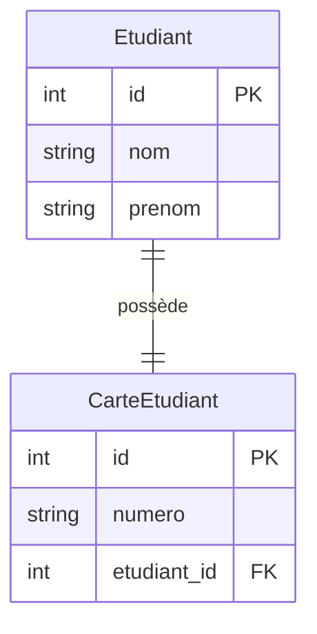
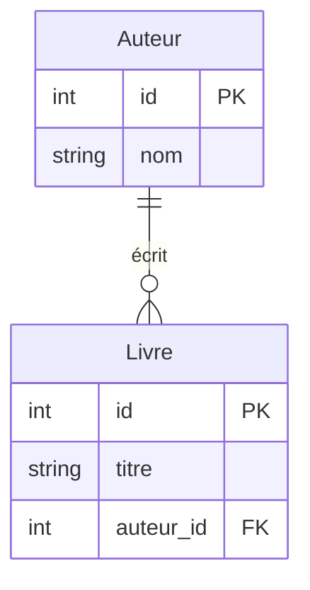
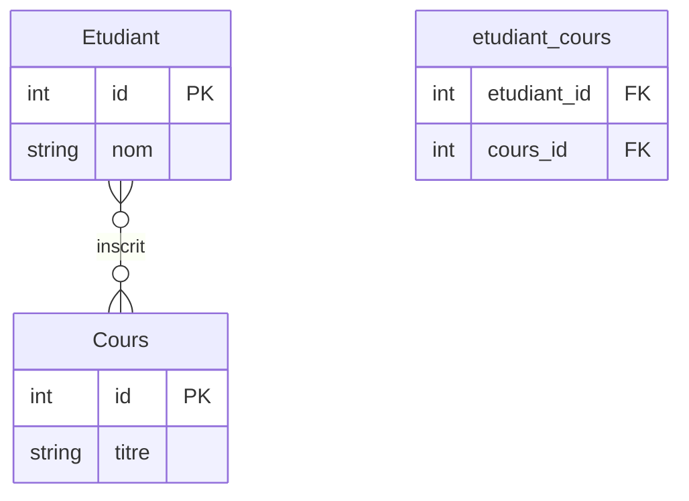

# <h1 id="relations-sqlalchemy">Définir des Relations ORM avec SQLAlchemy</h1>

## <h2 id="intro">Introduction</h2>

Dans une base relationnelle, les **relations entre entités** sont fondamentales. SQLAlchemy, en tant qu’ORM Python, permet de modéliser ces relations de façon naturelle grâce aux mots-clés :

* `ForeignKey`
* `relationship`
* `back_populates`
* `uselist`
* `secondary` (pour N\:N)


## <h2 id="relation-1-1">1. Relation 1:1 – Un à un</h2>

### Définition

Chaque élément A est associé à **exactement un élément B**, et réciproquement.

### Exemple

Un **étudiant** possède une **seule carte étudiante**.

### Diagramme



### Code SQLAlchemy

```python
class Etudiant(Base):
    __tablename__ = "etudiants"
    id = Column(Integer, primary_key=True)
    nom = Column(String)
    prenom = Column(String)
    carte = relationship("CarteEtudiant", back_populates="etudiant", uselist=False)

class CarteEtudiant(Base):
    __tablename__ = "cartes"
    id = Column(Integer, primary_key=True)
    numero = Column(String)
    etudiant_id = Column(Integer, ForeignKey("etudiants.id"), unique=True)
    etudiant = relationship("Etudiant", back_populates="carte")
```

### Points importants

* `uselist=False` → relation non-liste (objet unique)
* `unique=True` → empêche deux cartes pour un même étudiant


## <h2 id="relation-1-n">2. Relation 1\:N – Un à plusieurs</h2>

### Définition

Un élément A est associé à **plusieurs éléments B**.
Chaque B est lié à **un seul A**.

### Exemple

Un **auteur** peut avoir plusieurs **livres**.

### Diagramme



### Code SQLAlchemy

```python
class Auteur(Base):
    __tablename__ = "auteurs"
    id = Column(Integer, primary_key=True)
    nom = Column(String)
    livres = relationship("Livre", back_populates="auteur")

class Livre(Base):
    __tablename__ = "livres"
    id = Column(Integer, primary_key=True)
    titre = Column(String)
    auteur_id = Column(Integer, ForeignKey("auteurs.id"))
    auteur = relationship("Auteur", back_populates="livres")
```

### Points importants

* `relationship()` côté parent → donne une **liste d’objets**
* `ForeignKey()` côté enfant → lie à un seul parent


## <h2 id="relation-0-n">3. Relation 0\:N – Zéro à plusieurs</h2>

### Définition

Un élément A peut être associé à **zéro ou plusieurs** éléments B.
Chaque B est toujours lié à **au plus un A**.

### Variante

Même que 1\:N, mais **la clé étrangère est facultative (`nullable=True`)**.

### Exemple

Un **projet** peut avoir **zéro ou plusieurs tâches**.

### Code spécifique (changement)

```python
projet_id = Column(Integer, ForeignKey("projets.id"), nullable=True)
```


## <h2 id="relation-n-n">4. Relation N\:N – Plusieurs à plusieurs</h2>

### Définition

Un élément A peut être lié à **plusieurs éléments B**
ET chaque élément B peut être lié à **plusieurs A**.

### Exemple

Un **étudiant** peut suivre plusieurs **cours**,
un **cours** peut avoir plusieurs **étudiants**.

### Diagramme



### Table d’association

```python
etudiant_cours = Table(
    "etudiant_cours", Base.metadata,
    Column("etudiant_id", ForeignKey("etudiants.id"), primary_key=True),
    Column("cours_id", ForeignKey("cours.id"), primary_key=True)
)
```

### Modèles complets

```python
class Etudiant(Base):
    __tablename__ = "etudiants"
    id = Column(Integer, primary_key=True)
    nom = Column(String)
    cours = relationship("Cours", secondary=etudiant_cours, back_populates="etudiants")

class Cours(Base):
    __tablename__ = "cours"
    id = Column(Integer, primary_key=True)
    titre = Column(String)
    etudiants = relationship("Etudiant", secondary=etudiant_cours, back_populates="cours")
```

### Points importants

* `secondary=...` → utilisé pour les **relations N\:N**
* Aucun modèle Python n’est associé à la **table d’association**


## <h2 id="recap">5. Tableau récapitulatif des types de relations</h2>

| Type de relation | Côté propriétaire (clé étrangère) | Clé `unique` ? | `uselist` ? (côté inverse) | Exemples         | SQLAlchemy |
| ---------------- | --------------------------------- | -------------- | -------------------------- | ---------------- | ---------- |
| 1:1              | Oui                               | Oui            | `False`                    | Étudiant ↔ Carte | ✅          |
| 1\:N             | Oui (dans B)                      | Non            | `True` (liste)             | Auteur → Livres  | ✅          |
| 0\:N             | Oui                               | Non            | `True`                     | Projet → Tâches  | ✅          |
| N\:N             | Table d’association               | N/A            | N/A                        | Étudiant ↔ Cours | ✅          |


## <h2 id="bonus">6. Astuces avancées</h2>

* Utilisez `back_populates` pour les **relations bidirectionnelles explicites**
* Vous pouvez utiliser `backref` pour une **relation rapide unidirectionnelle**
* Activez `echo=True` dans `create_engine()` pour **voir les requêtes SQL générées**
* Utilisez `nullable=False` pour **forcer une relation obligatoire**


## <h2 id="conclusion">7. Conclusion</h2>

SQLAlchemy vous permet de modéliser **toutes les cardinalités relationnelles classiques** d'une base de données :

* Un-à-un (1:1)
* Un-à-plusieurs (1\:N)
* Plusieurs-à-plusieurs (N\:N)
* Variantes optionnelles avec `nullable`, `unique`, `uselist`

Chaque relation a ses **règles de structure**, ses **implications fonctionnelles**, et ses **notations spécifiques** en SQLAlchemy.


<br/>
<br/>


# <h1 id="annexe-orm-clefs">Annexe – Référence complète des mots-clés SQLAlchemy ORM (relations)</h1>


## <h2 id="1-relationship">1. `relationship()`</h2>

### Définition

Permet de définir une **relation entre deux classes ORM** (équivalent à une jointure en base).

###  Syntaxe de base

```python
relationship("AutreClasse")
```

###  Utilisation

| Côté                  | Fonction                                                             |
| --------------------- | -------------------------------------------------------------------- |
| Parent (ex: `Auteur`) | Retourne une **liste d'enfants** (1\:N) ou un **objet unique** (1:1) |
| Enfant (ex: `Livre`)  | Retourne le **parent** associé                                       |

###  Options utiles

| Option                  | Explication                                                                           |
| ----------------------- | ------------------------------------------------------------------------------------- |
| `uselist=False`         | Indique que la relation retourne **un seul objet**, pas une liste (relation 1:1)      |
| `back_populates`        | Crée une relation **bidirectionnelle explicite**                                      |
| `backref="nom"`         | Crée une relation **bidirectionnelle implicite** (plus rapide mais moins contrôlable) |
| `secondary=table`       | Obligatoire pour les **relations N\:N** (table d’association)                         |
| `cascade="all, delete"` | Supprime aussi les enfants associés (effet cascade)                                   |


## <h2 id="2-back-populates">2. `back_populates`</h2>

###  Définition

Permet de lier **explicitement** deux `relationship()` pour créer une **relation bidirectionnelle**.

###  Important

Doit être **défini des deux côtés** de la relation.

###  Exemple 1:1

```python
class Etudiant(Base):
    ...
    carte = relationship("CarteEtudiant", back_populates="etudiant", uselist=False)

class CarteEtudiant(Base):
    ...
    etudiant = relationship("Etudiant", back_populates="carte")
```


## <h2 id="3-backref">3. `backref`</h2>

### Définition

Version **abrégée** de `back_populates` qui **crée automatiquement le lien inverse**.

### ✅ Plus rapide, ❌ moins explicite

```python
class Livre(Base):
    ...
    auteur = relationship("Auteur", backref="livres")
```

Cela crée automatiquement :

* `Livre.auteur`
* `Auteur.livres` *(liste générée dynamiquement)*


## <h2 id="4-foreignkey">4. `ForeignKey`</h2>

### Définition

Spécifie une **clé étrangère SQL** dans une table ORM.

### Syntaxe

```python
auteur_id = Column(Integer, ForeignKey("auteurs.id"))
```

### Fonction

* Permet de lier une ligne à une autre table
* Crée une **relation de contrainte** au niveau SQL (comme `FOREIGN KEY`)


## <h2 id="5-secondary">5. `secondary=`</h2>

### Définition

Utilisé pour les **relations N\:N**, indique le **nom de la table d’association**.

### Exemple

```python
etudiant_cours = Table(
    "etudiant_cours", Base.metadata,
    Column("etudiant_id", ForeignKey("etudiants.id"), primary_key=True),
    Column("cours_id", ForeignKey("cours.id"), primary_key=True)
)

class Etudiant(Base):
    ...
    cours = relationship("Cours", secondary=etudiant_cours, back_populates="etudiants")
```

###  Obligation

* `secondary` doit référencer un objet `Table`, **pas une classe**.


## <h2 id="6-uselist">6. `uselist=False`</h2>

### Définition

Utilisé dans `relationship()` pour **forcer une relation 1:1** au lieu d’une relation par défaut 1\:N.

### Exemple

```python
carte = relationship("CarteEtudiant", back_populates="etudiant", uselist=False)
```

Sans cela, SQLAlchemy retourne une **liste**, même s’il n’y a qu’un seul élément.


## <h2 id="7-unique">7. `unique=True`</h2>

### Définition

Ajoute une **contrainte d’unicité** sur la colonne (au niveau SQL).

### Exemple

```python
etudiant_id = Column(Integer, ForeignKey("etudiants.id"), unique=True)
```

### Utilité

* Empêche deux lignes d’avoir la même valeur (utile pour relations 1:1).


## <h2 id="8-nullable">8. `nullable=True / False`</h2>

### Définition

Détermine si la colonne peut être **vide (NULL)**.

### Exemple

```python
auteur_id = Column(Integer, ForeignKey("auteurs.id"), nullable=True)
```

### Interprétation

| Valeur           | Signification                                                         |
| ---------------- | --------------------------------------------------------------------- |
| `nullable=True`  | La colonne peut rester vide (relation 0\:N ou optionnelle)            |
| `nullable=False` | La colonne **doit obligatoirement avoir une valeur** (relation forte) |


## <h2 id="9-cascade">9. `cascade="all, delete"`</h2>

###  Définition

Permet de **propager automatiquement** les suppressions à travers les relations.

### Exemple

```python
livres = relationship("Livre", back_populates="auteur", cascade="all, delete")
```

Si un auteur est supprimé, **tous ses livres** le seront aussi automatiquement.


## <h2 id="10-primaryjoin">10. `primaryjoin`</h2>

### Définition

Permet de **personnaliser la clause SQL JOIN** quand SQLAlchemy n'arrive pas à la déduire tout seul.

### Exemple avancé

```python
relationship("Livre", primaryjoin="Auteur.id==Livre.auteur_id")
```


# <h2 id="recap-final">Tableau récapitulatif final</h2>

| Mot-clé             | Type         | Description courte                                                           |
| ------------------- | ------------ | ---------------------------------------------------------------------------- |
| `relationship()`    | Fonction ORM | Définit une relation entre deux classes                                      |
| `back_populates`    | Option       | Lie deux `relationship()` de façon explicite et bidirectionnelle             |
| `backref`           | Option       | Crée automatiquement l’attribut inverse d’un `relationship()`                |
| `ForeignKey(...)`   | Fonction     | Définit une contrainte de clé étrangère (relation SQL)                       |
| `secondary=...`     | Option       | Indique une table d’association pour une relation **N\:N**                   |
| `uselist=False`     | Option       | Force la relation à retourner un objet unique (relation 1:1)                 |
| `unique=True`       | Contrainte   | Empêche la duplication de valeurs dans une colonne                           |
| `nullable=False`    | Contrainte   | Rend obligatoire une valeur pour une colonne                                 |
| `cascade="..."`     | Option       | Applique automatiquement des suppressions ou modifications liées à un parent |
| `primaryjoin="..."` | Option       | Personnalise manuellement la clause `ON` pour une jointure                   |


## <h2 id="conclusion">Conclusion</h2>

Cette annexe fournit la **boîte à outils complète** pour maîtriser la modélisation relationnelle dans SQLAlchemy ORM. En comprenant chacun de ces mots-clés, vous êtes capables de :

* Modéliser toute **cardinalité relationnelle** (1:1, 1\:N, N\:N, etc.)
* Gérer les **contraintes de base SQL**
* Créer des applications robustes avec une **structure de base bien pensée**


