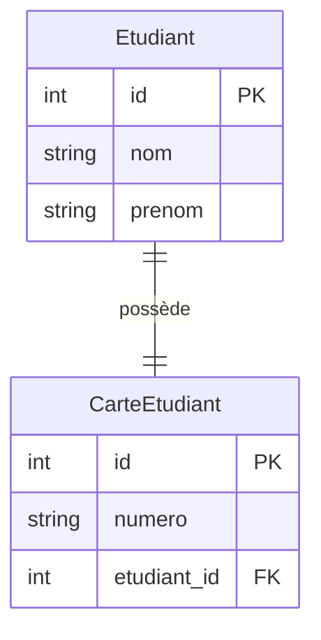
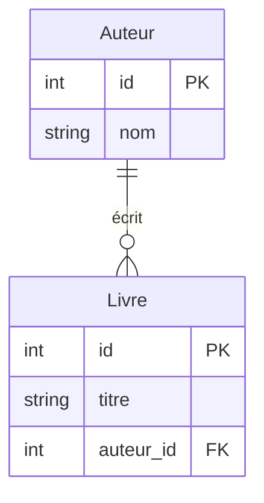
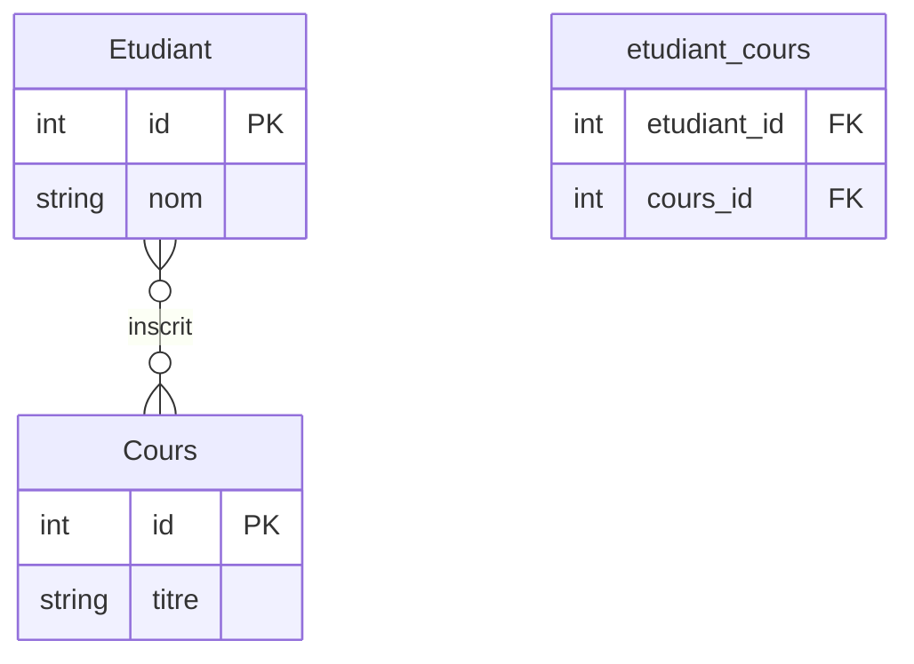

# Définir des modèles ORM relationnels


# <h1 id="relations-sqlalchemy">Cours complet — Relations ORM avec SQLAlchemy</h1>

## <h2 id="intro">Introduction</h2>

Dans une base relationnelle, les **relations entre entités** sont fondamentales. SQLAlchemy, en tant qu’ORM Python, permet de modéliser ces relations de façon naturelle grâce aux mots-clés :

* `ForeignKey`
* `relationship`
* `back_populates`
* `uselist`
* `secondary` (pour N\:N)


## <h2 id="relation-1-1">1. Relation 1:1 – Un à un</h2>

### Définition

Chaque élément A est associé à **exactement un élément B**, et réciproquement.

### Exemple

Un **étudiant** possède une **seule carte étudiante**.

### Diagramme



### Code SQLAlchemy

```python
class Etudiant(Base):
    __tablename__ = "etudiants"
    id = Column(Integer, primary_key=True)
    nom = Column(String)
    prenom = Column(String)
    carte = relationship("CarteEtudiant", back_populates="etudiant", uselist=False)

class CarteEtudiant(Base):
    __tablename__ = "cartes"
    id = Column(Integer, primary_key=True)
    numero = Column(String)
    etudiant_id = Column(Integer, ForeignKey("etudiants.id"), unique=True)
    etudiant = relationship("Etudiant", back_populates="carte")
```

### Points importants

* `uselist=False` → relation non-liste (objet unique)
* `unique=True` → empêche deux cartes pour un même étudiant


## <h2 id="relation-1-n">2. Relation 1\:N – Un à plusieurs</h2>

### Définition

Un élément A est associé à **plusieurs éléments B**.
Chaque B est lié à **un seul A**.

### Exemple

Un **auteur** peut avoir plusieurs **livres**.

### Diagramme



### Code SQLAlchemy

```python
class Auteur(Base):
    __tablename__ = "auteurs"
    id = Column(Integer, primary_key=True)
    nom = Column(String)
    livres = relationship("Livre", back_populates="auteur")

class Livre(Base):
    __tablename__ = "livres"
    id = Column(Integer, primary_key=True)
    titre = Column(String)
    auteur_id = Column(Integer, ForeignKey("auteurs.id"))
    auteur = relationship("Auteur", back_populates="livres")
```

### Points importants

* `relationship()` côté parent → donne une **liste d’objets**
* `ForeignKey()` côté enfant → lie à un seul parent


## <h2 id="relation-0-n">3. Relation 0\:N – Zéro à plusieurs</h2>

### Définition

Un élément A peut être associé à **zéro ou plusieurs** éléments B.
Chaque B est toujours lié à **au plus un A**.

### Variante

Même que 1\:N, mais **la clé étrangère est facultative (`nullable=True`)**.

### Exemple

Un **projet** peut avoir **zéro ou plusieurs tâches**.

### Code spécifique (changement)

```python
projet_id = Column(Integer, ForeignKey("projets.id"), nullable=True)
```


## <h2 id="relation-n-n">4. Relation N\:N – Plusieurs à plusieurs</h2>

### Définition

Un élément A peut être lié à **plusieurs éléments B**
ET chaque élément B peut être lié à **plusieurs A**.

### Exemple

Un **étudiant** peut suivre plusieurs **cours**,
un **cours** peut avoir plusieurs **étudiants**.

### Diagramme



### Table d’association

```python
etudiant_cours = Table(
    "etudiant_cours", Base.metadata,
    Column("etudiant_id", ForeignKey("etudiants.id"), primary_key=True),
    Column("cours_id", ForeignKey("cours.id"), primary_key=True)
)
```

### Modèles complets

```python
class Etudiant(Base):
    __tablename__ = "etudiants"
    id = Column(Integer, primary_key=True)
    nom = Column(String)
    cours = relationship("Cours", secondary=etudiant_cours, back_populates="etudiants")

class Cours(Base):
    __tablename__ = "cours"
    id = Column(Integer, primary_key=True)
    titre = Column(String)
    etudiants = relationship("Etudiant", secondary=etudiant_cours, back_populates="cours")
```

### Points importants

* `secondary=...` → utilisé pour les **relations N\:N**
* Aucun modèle Python n’est associé à la **table d’association**


## <h2 id="recap">5. Tableau récapitulatif des types de relations</h2>

| Type de relation | Côté propriétaire (clé étrangère) | Clé `unique` ? | `uselist` ? (côté inverse) | Exemples         | SQLAlchemy |
| ---------------- | --------------------------------- | -------------- | -------------------------- | ---------------- | ---------- |
| 1:1              | Oui                               | Oui            | `False`                    | Étudiant ↔ Carte | ✅          |
| 1\:N             | Oui (dans B)                      | Non            | `True` (liste)             | Auteur → Livres  | ✅          |
| 0\:N             | Oui                               | Non            | `True`                     | Projet → Tâches  | ✅          |
| N\:N             | Table d’association               | N/A            | N/A                        | Étudiant ↔ Cours | ✅          |


## <h2 id="bonus">6. Astuces avancées</h2>

* Utilisez `back_populates` pour les **relations bidirectionnelles explicites**
* Vous pouvez utiliser `backref` pour une **relation rapide unidirectionnelle**
* Activez `echo=True` dans `create_engine()` pour **voir les requêtes SQL générées**
* Utilisez `nullable=False` pour **forcer une relation obligatoire**


## <h2 id="conclusion">7. Conclusion</h2>

SQLAlchemy vous permet de modéliser **toutes les cardinalités relationnelles classiques** d'une base de données :

* Un-à-un (1:1)
* Un-à-plusieurs (1\:N)
* Plusieurs-à-plusieurs (N\:N)
* Variantes optionnelles avec `nullable`, `unique`, `uselist`

Chaque relation a ses **règles de structure**, ses **implications fonctionnelles**, et ses **notations spécifiques** en SQLAlchemy.

