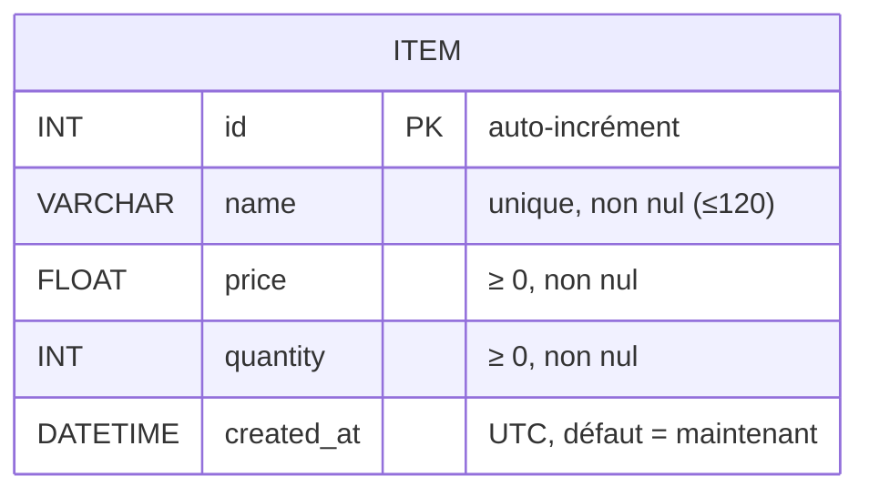
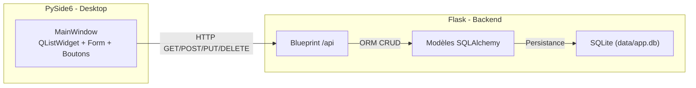
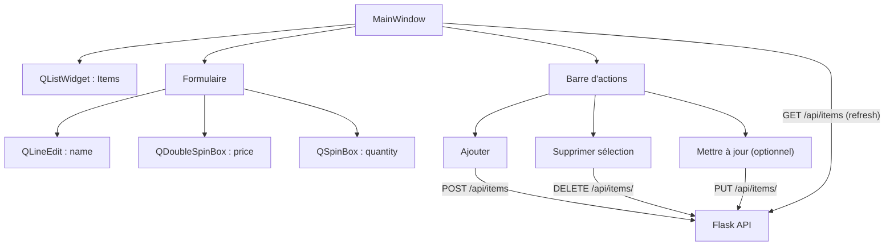
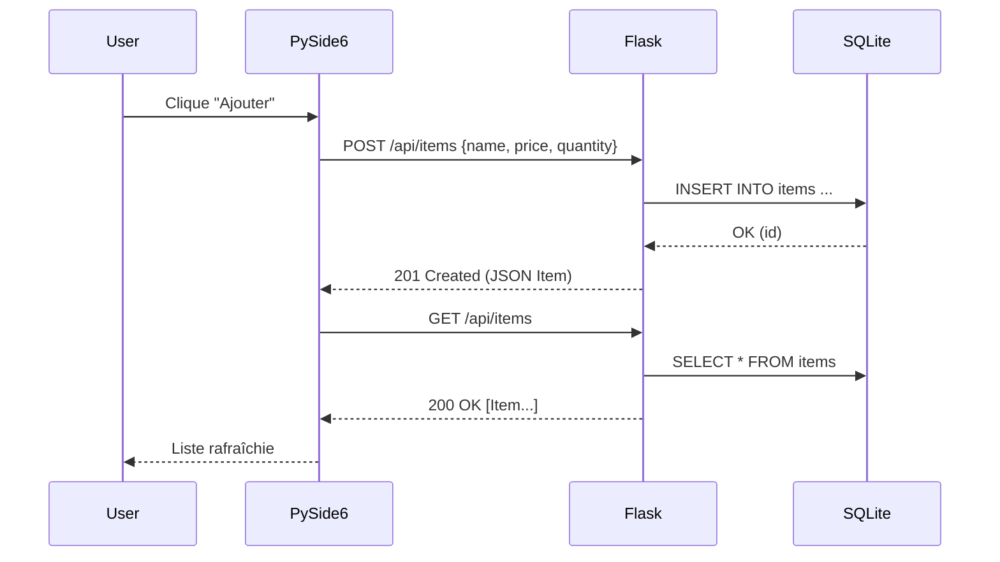

# TRAVAIL PRATIQUE – FLASK (CRUD) + SQLALCHEMY + PYSIDE6

**Nom de l’étudiant** : \_\_\_\_\_\_\_\_\_\_\_\_\_\_\_\_\_\_\_\_\_\_\_\_\_\_\_  **Groupe** : \_\_\_\_\_\_\_\_\_\_\_\_

<br/>

## 0) Objectifs pédagogiques

* Mettre en place une **API REST** avec **Flask** (Blueprint API).
* Manipuler une base **SQLite** via **SQLAlchemy** (ORM).
* Construire une **application desktop** **PySide6** qui consomme l’API.
* Assurer la **liaison des couches** (UI ↔ API ↔ DB) en CRUD complet.

---

## 1) Préparation du projet (sans Git)

**Arborescence attendue :**

```
projet_flask_qt/
├─ app/
│  ├─ __init__.py        # create_app(), config, enregistrement blueprints
│  ├─ extensions.py      # db = SQLAlchemy()
│  ├─ models.py          # modèles SQLAlchemy
│  ├─ api.py             # Blueprint API (CRUD Items en JSON)
│  └─ config.py          # configuration (DATABASE_URI, SECRET_KEY)
├─ pyside_app.py         # application PySide6 (client)
├─ requirements.txt
└─ data/                 # base SQLite (ex: data/app.db)
```

**requirements.txt (à créer) :**

```
Flask
Flask-SQLAlchemy
python-dotenv
requests
PySide6
```

*(Vous pouvez ajouter `pytest` / `httpx` si vous prévoyez des tests automatisés.)*

---

## 2) Schéma clair de la base de données (Mermaid – ERD)

> Implémentez ce modèle **minimum** (extension possible selon consignes).



---

## 3) Schéma de l’architecture et des liaisons (Mermaid)



---

## 4) Flask – squelette et initialisation

**Fichiers à créer/modifier :** `app/__init__.py`, `app/config.py`, `app/extensions.py`

`app/config.py`

```python
# TODO:
# - classe Config avec SQLALCHEMY_DATABASE_URI = "sqlite:///data/app.db"
# - SQLALCHEMY_TRACK_MODIFICATIONS = False
# - SECRET_KEY depuis env (optionnel)
................................................................................
```

`app/extensions.py`

```python
# TODO:
# - créer l'instance SQLAlchemy partagée: db = SQLAlchemy()
# from flask_sqlalchemy import SQLAlchemy
................................................................................
```

`app/__init__.py`

```python
# TODO:
# - create_app(): instancier Flask, charger Config
# - init_app(db) sur l'app, créer data/ si nécessaire
# - enregistrer le blueprint API (depuis .api import api_bp)
# - créer les tables avec db.create_all(app=app) (pédagogique)
# from flask import Flask
# from .config import Config
# from .extensions import db
# from .api import api_bp
................................................................................
```

**Lancement local (exemples) :**

```
# Méthode 1 : flask run (si FLASK_APP défini)
export FLASK_APP=app:create_app
flask run --debug

# Méthode 2 : petit runner
python -c "from app import create_app; app=create_app(); app.run(debug=True)"
```

---

## 5) SQLAlchemy – modèles

**Fichier :** `app/models.py` (utilise `db` de `extensions.py`)

```python
# TODO:
# - définir le modèle Item conforme à l’ERD
# - colonnes: id (pk), name (unique, non nul), price (float >=0), quantity (int >=0), created_at (datetime UTC par défaut)
# from datetime import datetime, timezone
# from .extensions import db
# class Item(db.Model): __tablename__ = "items"; ...
................................................................................
```

---

## 6) API REST Flask – endpoints CRUD (JSON)

**Fichier :** `app/api.py` (Blueprint sous `/api`)

**Contrat attendu (réponses JSON) :**

* `GET /api/items` → `200 OK` `[ {id, name, price, quantity, created_at}, ... ]`
* `POST /api/items` (JSON `{name, price, quantity}`) → `201 Created` `{...}`
* `GET /api/items/<int:item_id>` → `200 OK` `{...}` ou `404`
* `PUT /api/items/<int:item_id>` (JSON partiel `{name?, price?, quantity?}`) → `200 OK` `{...}` ou `404/400`
* `DELETE /api/items/<int:item_id>` → `200 OK` `{"deleted": true, "id": ...}` ou `404`

**Validation minimale attendue :**

* `name` **non vide** (trim).
* `name` **unique** (refuser doublon).
* `price >= 0`, `quantity >= 0`.
* Messages d’erreur **clairs** (`400` / `404`).

```python
# TODO:
# - api_bp = Blueprint("api", __name__, url_prefix="/api")
# - utilitaire to_dict(item) pour sérialiser un Item
# - GET /items : retourner la liste
# - POST /items : valider, insérer, commit, retourner 201
# - GET /items/<id> : retourner l'item ou 404
# - PUT /items/<id> : modifications partielles, validations, commit
# - DELETE /items/<id> : supprimer si existe, commit
# from flask import Blueprint, request, jsonify
# from .extensions import db
# from .models import Item
................................................................................
```

---

## 7) PySide6 – interface à développer

**Fichier :** `pyside_app.py` (client desktop **indépendant** du serveur)

**Comportement fonctionnel minimal :**

* Au lancement, **charger la liste** des items via `GET /api/items`.
* Formulaire **Nom / Prix / Quantité** → bouton **Ajouter** : `POST /api/items`, puis **rafraîchir**.
* **Sélection** dans la liste → bouton **Supprimer** : `DELETE /api/items/<id>`, puis **rafraîchir**.
* (Optionnel) **Modifier** l’élément sélectionné : `PUT /api/items/<id>`.

**UI cible (Mermaid – structure et flux) :**



**À implémenter (zones à compléter) :**

```python
# TODO: créer une fenêtre PySide6 avec:
# - API_BASE = "http://127.0.0.1:5000/api"
# - QListWidget (liste)
# - QLineEdit (name), QDoubleSpinBox (price), QSpinBox (quantity)
# - Boutons: Ajouter / Supprimer sélection (/ Mettre à jour)
# - Méthode refresh_list(): GET /api/items -> peuple la QListWidget
# - add_item(): POST /api/items -> refresh_list()
# - delete_selected(): DELETE /api/items/<id> -> refresh_list()
# - (optionnel) update_selected(): PUT /api/items/<id> -> refresh_list()
# - utiliser requests (synchrones) pour la simplicité
................................................................................
```

**Scénario de test manuel :**

1. Lancer le serveur Flask (port 5000 par défaut) :

   ```
   python -c "from app import create_app; app=create_app(); app.run(debug=True)"
   ```

   Ouvrir éventuellement `http://127.0.0.1:5000/` si vous exposez une route d’accueil.

2. Lancer l’appli PySide6 :

   ```
   python pyside_app.py
   ```

   → La liste s’affiche.
   → Ajouter des items → ils apparaissent.
   → Sélectionner un item → **Supprimer sélection** → il disparaît.

---

## 8) (Facultatif) Vues HTML de vérification – Jinja2

> Utile si vous voulez **aussi** tester côté navigateur (non obligatoire si vous utilisez uniquement PySide6).

**Arborescence (optionnelle) :**

```
app/
  views.py          # Blueprint 'web'
templates/
  items_list.html   # simple liste
static/
  style.css
```

`app/views.py`

```python
# TODO:
# - web_bp = Blueprint("web", __name__)
# - GET /items : lire la DB et rendre templates/items_list.html avec items=...
# from flask import Blueprint, render_template
# from .extensions import db
# from .models import Item
................................................................................
```

`templates/items_list.html`

```html
<!-- TODO: tableau simple affichant id, name, price, quantity -->
................................................................................
```

`app/__init__.py` (montage)

```python
# TODO (si vous faites les vues):
# - app.register_blueprint(web_bp)
# - servir /static si nécessaire (Flask le fait nativement via 'static/')
................................................................................
```

---

## 9) Séquence d’interactions (Mermaid)



---

## 10) À rendre

Un **seul fichier** nommé :

```
tp_flask_sqlalchemy_pyside6_NOM_PRENOM.docx  (ou .pdf, .txt)
```

Doit contenir :

* Les **fichiers de code** (copiés dans le document) : `app/__init__.py`, `app/config.py`, `app/extensions.py`, `app/models.py`, `app/api.py`, `pyside_app.py`, (et `app/views.py` + `templates/*` si réalisés).
* Les **captures d’écran** montrant l’API en action (par exemple via curl/Postman) et l’appli PySide6 (liste avant/après ajout/suppression).
* Une **brève explication** de la liaison entre couches (UI ↔ API ↔ ORM/DB) et des validations faites côté API.

---

### Rappels importants

* **Toujours** valider les données côté API :

  * `name` non vide, **unicité** sur `name`, `price >= 0`, `quantity >= 0`.
* **Toujours** rafraîchir la liste côté PySide6 après chaque opération (POST/PUT/DELETE).
* Le fichier **SQLite** (ex: `data/app.db`) doit se créer automatiquement au premier lancement si absent.
* Pour éviter les erreurs de thread SQLite avec Flask en dev, **utilisez bien** SQLite via `sqlite:///data/app.db` et laissez Flask-SQLAlchemy gérer la session.


