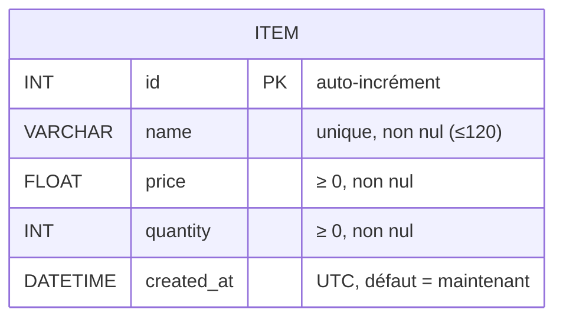
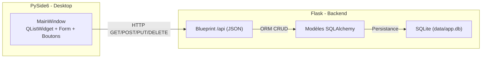
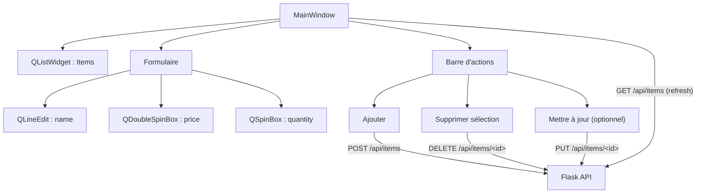

# ✅ 0) Arborescence finale

```
projet_flask_qt/
├─ app/
│  ├─ __init__.py        # create_app(), config, blueprints
│  ├─ extensions.py      # db = SQLAlchemy()
│  ├─ models.py          # modèles SQLAlchemy
│  ├─ api.py             # Blueprint API (CRUD JSON)
│  └─ config.py          # configuration (DATABASE_URI, SECRET_KEY)
├─ pyside_app.py         # application PySide6 (client)
├─ requirements.txt
└─ data/                 # base SQLite (ex: data/app.db)
```

---

# ✅ 1) `requirements.txt`

```txt
Flask==3.0.3
Flask-SQLAlchemy==3.1.1
python-dotenv==1.0.1
requests==2.32.3
PySide6==6.7.2
```

**Installation & lancement**

**macOS / Linux**

```bash
python3 -m venv venv
source venv/bin/activate
pip install -r requirements.txt

# Démarrer l’API Flask
python -c "from app import create_app; app=create_app(); app.run(debug=True)"

# Dans un autre terminal (même venv activé), lancer l’app PySide6
python pyside_app.py
```

**Windows (PowerShell)**

```powershell
python -m venv venv
venv\Scripts\Activate.ps1
pip install -r requirements.txt

# API Flask
python -c "from app import create_app; app=create_app(); app.run(debug=True)"

# Client PySide6
python pyside_app.py
```

Par défaut Flask écoute sur **[http://127.0.0.1:5000](http://127.0.0.1:5000)**.

---

# ✅ 2) Schémas (Mermaid)

## ERD (Base de données)



## Architecture & liaisons



## Interface PySide6 (structure & flux)



---

# ✅ 3) Code complet — dossier `app/`

## `app/config.py`

```python
from __future__ import annotations
import os

class Config:
    # Chemin SQLite relatif au projet (dossier data)
    SQLALCHEMY_DATABASE_URI = "sqlite:///data/app.db"
    SQLALCHEMY_TRACK_MODIFICATIONS = False
    # Clé secrète basique (pour extensions futures / sessions)
    SECRET_KEY = os.getenv("SECRET_KEY", "dev-secret-key-change-me")
```

## `app/extensions.py`

```python
from __future__ import annotations
from flask_sqlalchemy import SQLAlchemy

# Instance partagée de l’ORM
db = SQLAlchemy()
```

## `app/models.py`

```python
from __future__ import annotations
from datetime import datetime, timezone
from .extensions import db

class Item(db.Model):
    __tablename__ = "items"

    id = db.Column(db.Integer, primary_key=True)
    name = db.Column(db.String(120), unique=True, nullable=False, index=True)
    price = db.Column(db.Float, nullable=False, default=0.0)
    quantity = db.Column(db.Integer, nullable=False, default=0)
    created_at = db.Column(db.DateTime, nullable=False, default=lambda: datetime.now(timezone.utc))

    def to_dict(self) -> dict:
        return {
            "id": self.id,
            "name": self.name,
            "price": float(self.price),
            "quantity": int(self.quantity),
            "created_at": self.created_at.isoformat()
        }
```

## `app/api.py`

```python
from __future__ import annotations
from flask import Blueprint, request, jsonify
from sqlalchemy import select
from .extensions import db
from .models import Item

api_bp = Blueprint("api", __name__, url_prefix="/api")

def error(status: int, msg: str):
    return jsonify({"detail": msg}), status

@api_bp.get("/items")
def list_items():
    items = db.session.execute(select(Item).order_by(Item.id.desc())).scalars().all()
    return jsonify([i.to_dict() for i in items])

@api_bp.post("/items")
def create_item():
    data = request.get_json(silent=True) or {}
    name = str(data.get("name", "")).strip()
    price = data.get("price", 0)
    quantity = data.get("quantity", 0)

    if not name:
        return error(400, "Le nom est requis.")
    # Unicité du nom
    if db.session.execute(select(Item).where(Item.name == name)).scalar() is not None:
        return error(400, "Nom déjà utilisé.")

    # Validations numériques
    try:
        price = float(price)
        quantity = int(quantity)
    except Exception:
        return error(400, "Prix ou quantité invalide.")
    if price < 0 or quantity < 0:
        return error(400, "Prix/quantité doivent être ≥ 0.")

    it = Item(name=name, price=price, quantity=quantity)
    db.session.add(it)
    db.session.commit()
    return jsonify(it.to_dict()), 201

@api_bp.get("/items/<int:item_id>")
def get_item(item_id: int):
    it = db.session.get(Item, item_id)
    if not it:
        return error(404, "Item non trouvé.")
    return jsonify(it.to_dict())

@api_bp.put("/items/<int:item_id>")
def update_item(item_id: int):
    it = db.session.get(Item, item_id)
    if not it:
        return error(404, "Item non trouvé.")

    data = request.get_json(silent=True) or {}

    # name (optionnel)
    if "name" in data:
        name = str(data.get("name") or "").strip()
        if not name:
            return error(400, "Le nom ne peut pas être vide.")
        # Unicité (exclure l’item en cours)
        if db.session.execute(
            select(Item).where(Item.name == name, Item.id != item_id)
        ).scalar() is not None:
            return error(400, "Nom déjà utilisé.")
        it.name = name

    # price (optionnel)
    if "price" in data:
        try:
            price = float(data["price"])
        except Exception:
            return error(400, "Prix invalide.")
        if price < 0:
            return error(400, "Le prix doit être ≥ 0.")
        it.price = price

    # quantity (optionnel)
    if "quantity" in data:
        try:
            quantity = int(data["quantity"])
        except Exception:
            return error(400, "Quantité invalide.")
        if quantity < 0:
            return error(400, "La quantité doit être ≥ 0.")
        it.quantity = quantity

    db.session.commit()
    return jsonify(it.to_dict())

@api_bp.delete("/items/<int:item_id>")
def delete_item(item_id: int):
    it = db.session.get(Item, item_id)
    if not it:
        return error(404, "Item non trouvé.")
    db.session.delete(it)
    db.session.commit()
    return jsonify({"deleted": True, "id": item_id})
```

## `app/__init__.py`

```python
from __future__ import annotations
import os
from flask import Flask, jsonify
from .config import Config
from .extensions import db
from .api import api_bp

def create_app() -> Flask:
    # S’assure que le dossier data/ existe
    os.makedirs("data", exist_ok=True)

    app = Flask(__name__)
    app.config.from_object(Config)

    # Initialisation de l’ORM
    db.init_app(app)

    # Création des tables (pédagogique)
    with app.app_context():
        db.create_all()

    # Route d’accueil simple (utile pour ping)
    @app.get("/")
    def health():
        return jsonify({"status": "ok", "api": "/api/items"})

    # Enregistrement du Blueprint API JSON
    app.register_blueprint(api_bp)

    return app
```

---

# ✅ 4) Client PySide6 — `pyside_app.py`

> Petite fenêtre **desktop** qui consomme l’API Flask (liste + ajout + suppression).
> (Vous pourrez ajouter l’édition PUT en exercice bonus.)

```python
from __future__ import annotations
import sys
import requests
from PySide6.QtWidgets import (
    QApplication, QWidget, QVBoxLayout, QHBoxLayout,
    QLabel, QLineEdit, QDoubleSpinBox, QSpinBox,
    QPushButton, QListWidget, QListWidgetItem, QMessageBox
)

API_BASE = "http://127.0.0.1:5000/api"

class ItemClient(QWidget):
    def __init__(self):
        super().__init__()
        self.setWindowTitle("Inventaire (PySide6 + Flask)")
        self.resize(520, 540)

        root = QVBoxLayout(self)

        # Liste
        root.addWidget(QLabel("Articles :"))
        self.list_widget = QListWidget()
        root.addWidget(self.list_widget)

        # Formulaire
        form = QHBoxLayout()
        self.name_edit = QLineEdit()
        self.name_edit.setPlaceholderText("Nom")
        self.price_spin = QDoubleSpinBox()
        self.price_spin.setRange(0, 1_000_000)
        self.price_spin.setDecimals(2)
        self.price_spin.setValue(10.0)
        self.qty_spin = QSpinBox()
        self.qty_spin.setRange(0, 1_000_000)
        self.qty_spin.setValue(1)

        form.addWidget(QLabel("Nom:"))
        form.addWidget(self.name_edit)
        form.addWidget(QLabel("Prix:"))
        form.addWidget(self.price_spin)
        form.addWidget(QLabel("Qté:"))
        form.addWidget(self.qty_spin)
        root.addLayout(form)

        # Boutons
        actions = QHBoxLayout()
        self.btn_add = QPushButton("Ajouter")
        self.btn_delete = QPushButton("Supprimer sélection")
        actions.addWidget(self.btn_add)
        actions.addWidget(self.btn_delete)
        root.addLayout(actions)

        # Connexions
        self.btn_add.clicked.connect(self.add_item)
        self.btn_delete.clicked.connect(self.delete_selected)

        # Chargement initial
        self.refresh_list()

    def refresh_list(self):
        self.list_widget.clear()
        try:
            r = requests.get(f"{API_BASE}/items", timeout=5)
            r.raise_for_status()
            for it in r.json():
                # Affichage: "ID - Nom (Prix €, Qté X)"
                label = f"{it['id']} - {it['name']} ({it['price']:.2f} €, Qté {it['quantity']})"
                item = QListWidgetItem(label)
                item.setData(32, it)  # Qt.UserRole = 32
                self.list_widget.addItem(item)
        except Exception as e:
            QMessageBox.critical(self, "Erreur", f"Impossible de charger la liste:\n{e}")

    def add_item(self):
        name = self.name_edit.text().strip()
        price = float(self.price_spin.value())
        qty = int(self.qty_spin.value())
        if not name:
            QMessageBox.warning(self, "Validation", "Le nom est obligatoire.")
            return
        try:
            r = requests.post(
                f"{API_BASE}/items",
                json={"name": name, "price": price, "quantity": qty},
                timeout=5
            )
            if r.status_code == 201:
                self.name_edit.clear()
                self.price_spin.setValue(10.0)
                self.qty_spin.setValue(1)
                self.refresh_list()
            else:
                QMessageBox.warning(self, "API", f"Erreur {r.status_code} : {r.text}")
        except Exception as e:
            QMessageBox.critical(self, "Erreur", f"Échec d'ajout:\n{e}")

    def delete_selected(self):
        it = self.list_widget.currentItem()
        if not it:
            QMessageBox.information(self, "Info", "Sélectionnez un article à supprimer.")
            return
        data = it.data(32)
        item_id = data["id"]
        try:
            r = requests.delete(f"{API_BASE}/items/{item_id}", timeout=5)
            if r.status_code == 200:
                self.refresh_list()
            elif r.status_code == 404:
                QMessageBox.warning(self, "API", "Item introuvable (déjà supprimé ?)")
                self.refresh_list()
            else:
                QMessageBox.warning(self, "API", f"Erreur {r.status_code} : {r.text}")
        except Exception as e:
            QMessageBox.critical(self, "Erreur", f"Échec de suppression:\n{e}")

if __name__ == "__main__":
    app = QApplication(sys.argv)
    w = ItemClient()
    w.show()
    sys.exit(app.exec())
```

---

# ✅ 5) Tests manuels (simples & rapides)

1. **Démarrer l’API Flask**

```bash
python -c "from app import create_app; app=create_app(); app.run(debug=True)"
```

→ Ouvrir `http://127.0.0.1:5000/` (doit retourner `{"status":"ok", ...}`).

2. **Tester vite en ligne de commande (facultatif)**

```bash
# Lister (vide au début)
curl -s http://127.0.0.1:5000/api/items | jq

# Créer
curl -s -X POST http://127.0.0.1:5000/api/items \
  -H "Content-Type: application/json" \
  -d '{"name":"Stylo","price":1.5,"quantity":10}' | jq

# Relister
curl -s http://127.0.0.1:5000/api/items | jq

# Supprimer l’ID 1
curl -s -X DELETE http://127.0.0.1:5000/api/items/1 | jq
```

3. **Lancer l’appli PySide6**

```bash
python pyside_app.py
```

* Ajouter 2–3 items → ils apparaissent dans la liste.
* Sélectionner un item → **Supprimer sélection** → il disparaît.
* Relancer l’appli → les items restent (persistés en SQLite **data/app.db**).

---

# ✅ 6) Explications pédagogiques & pièges

* **Validation côté API** :

  * `name` non vide + **unicité** (`unique=True` côté ORM + vérif côté API pour message clair).
  * `price ≥ 0`, `quantity ≥ 0`.
* **Sessions DB** : Flask-SQLAlchemy gère la session via `db.session`. Toujours `commit()` après écriture.
* **SQLite** : nécessite que le dossier `data/` existe (on le crée dans `create_app()` via `os.makedirs`).
* **PySide6** : pas de CORS (ce n’est pas un navigateur). On utilise **requests** (synchrone) pour la simplicité.
* **Erreurs fréquentes** :

  * Lancer PySide **avant** le serveur → échec de connexion.
  * `Nom déjà utilisé` → message 400 explicite.
  * `price`/`quantity` non numériques → 400.

---

# ✅ 7) Bonus (pour aller plus loin)

* Ajouter une fenêtre **d’édition** (PUT) dans PySide6 (bouton “Mettre à jour”).
* Ajouter une table `Category` (FK dans `Item`).
* Pagination sur `GET /api/items`.
* Tests unitaires (pytest) avec base de test éphémère.


