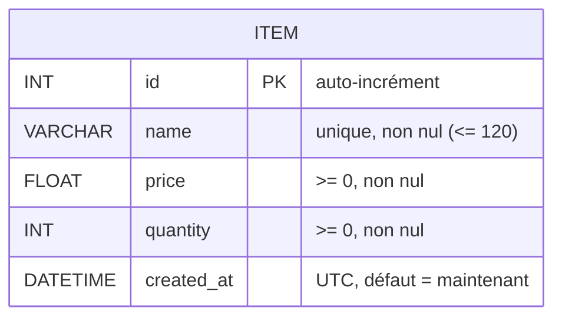
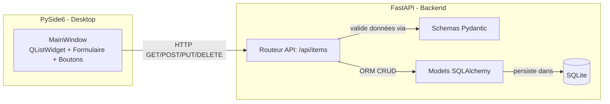
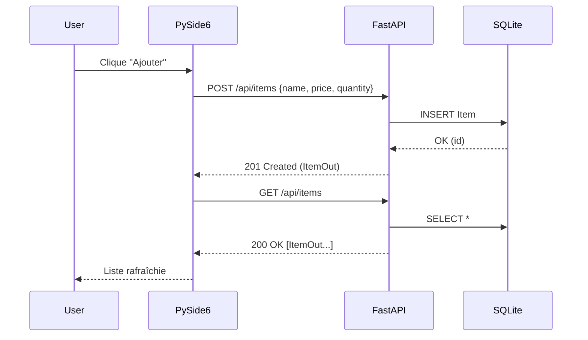

# TRAVAIL PRATIQUE – FASTAPI (CRUD) + SQLALCHEMY + PYSIDE6

**Nom de l’étudiant** : \_\_\_\_\_\_\_\_\_\_\_\_\_\_\_\_\_\_\_\_\_\_\_\_\_\_\_  **Groupe** : \_\_\_\_\_\_\_\_\_\_\_\_

<br/>

## 0) Objectifs pédagogiques

* Mettre en place une **API REST** avec **FastAPI**.
* Manipuler une base **SQLite** via **SQLAlchemy** (ORM).
* Construire une **application desktop** **PySide6** qui consomme l’API.
* Assurer la **liaison des couches** (UI ↔ API ↔ DB) en CRUD complet.

---

## 1) Préparation du projet (sans Git)

**Arborescence attendue :**

```
projet_fastapi_qt/
├─ app/
│  ├─ __init__.py
│  ├─ main.py           # FastAPI (montage routes + static si besoin)
│  ├─ db.py             # engine, session, Base, dépendance get_db()
│  ├─ models.py         # modèles SQLAlchemy
│  ├─ schemas.py        # schémas Pydantic (entrées/sorties API)
│  └─ api.py            # routeur API (CRUD Items)
├─ pyside_app.py        # application PySide6 (client)
├─ requirements.txt
└─ data/                # base SQLite (ex: data/app.db)
```

**requirements.txt (à créer) :**

```
fastapi
uvicorn[standard]
SQLAlchemy
pydantic
Jinja2
python-dotenv
httpx
requests
PySide6
```

---

## 2) Schéma clair de la base de données (Mermaid – ERD)

> Implémentez ce modèle **minimum** (possible d’enrichir si indiqué par l’enseignant).



---

## 3) Schéma de l’architecture et des liaisons (Mermaid)



---

## 4) FastAPI – squelette et initialisation

**Fichiers à créer/modifier :** `app/__init__.py`, `app/main.py`

`app/__init__.py`

```python
# TODO: fichier de package (laisser vide ou avec un commentaire)
................................................................................
```

`app/main.py`

```python
# TODO: créer l'application FastAPI (title, etc.)
# TODO: importer et monter l'API (from .api import api)
# TODO: créer les tables (Base.metadata.create_all(bind=engine))
# TODO: route "/" simple (ex: redirection vers /docs)
# from fastapi import FastAPI
# from fastapi.responses import RedirectResponse
# from .db import Base, engine
# from .api import api
................................................................................
```

**Lancement local (exemple) :**

```
uvicorn app.main:app --reload
```

---

## 5) SQLAlchemy – configuration ORM

**Fichiers :** `app/db.py`, `app/models.py`

`app/db.py`

```python
# TODO:
# - définir DATABASE_URL (ex: "sqlite:///data/app.db")
# - create_engine(..., connect_args={"check_same_thread": False} pour SQLite)
# - SessionLocal = sessionmaker(...)
# - Base = DeclarativeBase ou declarative_base()
# - get_db(): générateur FastAPI qui yield une session et la ferme
# from sqlalchemy import create_engine
# from sqlalchemy.orm import sessionmaker, DeclarativeBase
................................................................................
```

`app/models.py`

```python
# TODO: modèle SQLAlchemy Item conforme à l’ERD
# colonnes: id (pk), name (unique, non nul), price (float >=0), quantity (int >=0), created_at (datetime UTC par défaut)
# from sqlalchemy import Column, Integer, String, Float, DateTime
# from datetime import datetime
# from .db import Base
................................................................................
```

---

## 6) Pydantic – schémas d’entrée/sortie pour l’API

**Fichier :** `app/schemas.py`

```python
# TODO:
# - ItemCreate: name (str, min_length=1), price (float >=0), quantity (int >=0)
# - ItemUpdate: tous champs optionnels (name/price/quantity)
# - ItemOut: sortie complète (id, name, price, quantity, created_at)
# from pydantic import BaseModel, Field
# from typing import Optional
# from datetime import datetime
................................................................................
```

---

## 7) API REST – endpoints CRUD

**Fichier :** `app/api.py` (routeur sous `/api`)

**Contrat attendu :**

* `GET /api/items` → `200 OK` `[ItemOut, ...]`
* `POST /api/items` (JSON `ItemCreate`) → `201 Created` `ItemOut`
* `GET /api/items/{id}` → `200 OK` `ItemOut` ou `404`
* `PUT /api/items/{id}` (JSON `ItemUpdate`) → `200 OK` `ItemOut` ou `404/400`
* `DELETE /api/items/{id}` → `200 OK` `{"deleted": true, "id": …}` ou `404`

```python
# TODO:
# - api = APIRouter(prefix="/api", tags=["items"])
# - dépendance get_db()
# - validations (nom non vide, unicité du name, valeurs numériques valides)
# - conversions ORM -> Pydantic (ItemOut)
# from fastapi import APIRouter, Depends, HTTPException
# from sqlalchemy.orm import Session
# from .db import get_db
# from .models import Item
# from .schemas import ItemCreate, ItemUpdate, ItemOut
................................................................................
```

`app/main.py` (montage du routeur)

```python
# TODO: app.include_router(api)
................................................................................
```

---

## 8) PySide6 – interface à développer

**Fichier :** `pyside_app.py` (client desktop **indépendant** du serveur)

**Comportement fonctionnel minimal :**

* Au lancement, **charger la liste** des items via `GET /api/items`.
* Formulaire **Nom / Prix / Quantité** → bouton **Ajouter** : `POST /api/items`, puis **rafraîchir**.
* **Sélection** dans la liste → bouton **Supprimer** : `DELETE /api/items/{id}`, puis **rafraîchir**.
* (Optionnel) **Modifier** l’élément sélectionné : `PUT /api/items/{id}`.

**UI cible (Mermaid – structure et flux) :**

```mermaid
flowchart TD
    A[MainWindow] --> L[QListWidget : Items]
    A --> F[Formulaire]
    F --> FN[QLineEdit : name]
    F --> FP[QDoubleSpinBox : price]
    F --> FQ[QSpinBox : quantity]
    A --> B[Barre d'actions]
    B --> BA[Ajouter]
    B --> BD[Supprimer sélection]
    B --> BU[(Optionnel) Mettre à jour]

    %% Interactions réseau
    BA -- POST /api/items --> API[(FastAPI)]
    BD -- DELETE /api/items/{id} --> API
    A  -- GET /api/items (refresh) --> API
    BU -- PUT /api/items/{id} --> API
```

**À implémenter (zones à compléter) :**

```python
# TODO: créer une fenêtre PySide6 avec:
# - API_BASE = "http://127.0.0.1:8000/api"
# - QListWidget (liste)
# - QLineEdit (name), QDoubleSpinBox (price), QSpinBox (quantity)
# - Boutons: Ajouter / Supprimer sélection (/ Mettre à jour)
# - Méthode refresh_list(): GET /api/items -> peuple la QListWidget
# - add_item(): POST /api/items -> refresh_list()
# - delete_selected(): DELETE /api/items/{id} -> refresh_list()
# - (optionnel) update_selected(): PUT /api/items/{id} -> refresh_list()
# - utiliser requests (synchrones) ou httpx (async)
................................................................................
```

**Scénario de test manuel :**

1. Lancer le serveur : `uvicorn app.main:app --reload`
2. Lancer l’appli : `python pyside_app.py`
3. Ajouter quelques items, vérifier la liste, supprimer un item, re-vérifier.

---

## 9) (Facultatif) Vues HTML de vérification – Jinja2

> Utile si vous voulez **aussi** tester côté navigateur (non obligatoire si vous utilisez uniquement PySide6).

**Fichiers :** `app/views.py`, `templates/items_list.html`

`app/views.py`

```python
# TODO: APIRouter HTML (Jinja2Templates)
# GET /items -> rend un template listant les items depuis la DB
................................................................................
```

`templates/items_list.html`

```html
<!-- TODO: tableau simple affichant id, name, price, quantity -->
................................................................................
```

---

## 10) Annexes – Séquence d’interactions (Mermaid)



---

## 11) À rendre

Un **seul fichier** nommé :

```
tp_fastapi_sqlalchemy_pyside6_NOM_PRENOM.docx  (ou .pdf, .txt)
```

Doit contenir :

* Les **fichiers de code** (copiés dans le document) : `app/main.py`, `app/db.py`, `app/models.py`, `app/schemas.py`, `app/api.py`, `pyside_app.py`, (et `app/views.py` + `templates/*` si réalisés).
* Les **captures d’écran** montrant l’API (`/docs`) et l’appli PySide6 (liste avant/après ajout/suppression).
* (Optionnel) Brève **explication** de la liaison entre couches (UI ↔ API ↔ ORM/DB).

---

### Rappels importants

* **Toujours** valider les données côté API (types, bornes, unicité).
* **Toujours** rafraîchir la liste côté PySide6 après une opération d’écriture.
* Le fichier **SQLite** (ex: `data/app.db`) doit être **créé automatiquement** au premier lancement si absent.


