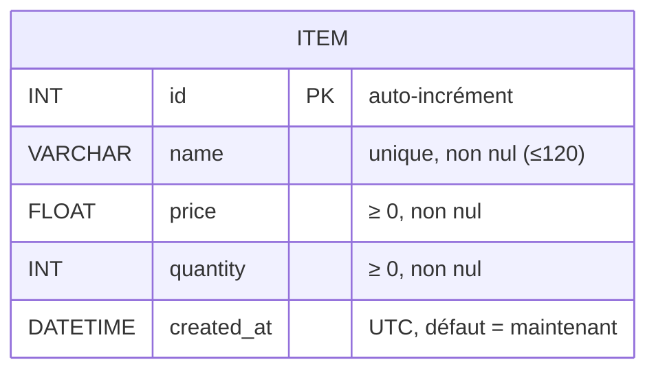
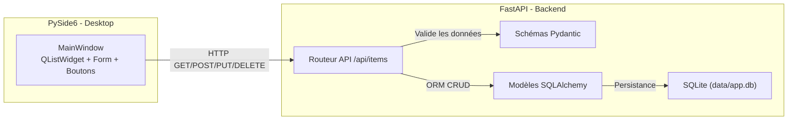
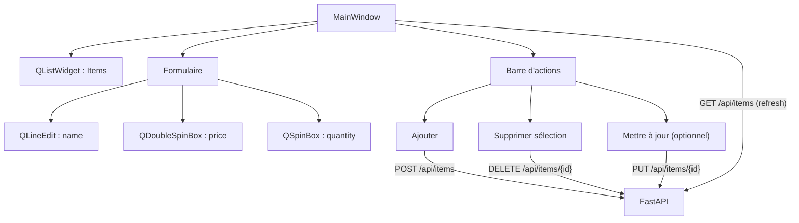

# ✅ 0) Arborescence finale du projet

```
projet_fastapi_qt/
├─ app/
│  ├─ __init__.py
│  ├─ db.py
│  ├─ models.py
│  ├─ schemas.py
│  ├─ api.py
│  └─ main.py
├─ pyside_app.py
├─ requirements.txt
└─ data/                # se crée au lancement si absent (SQLite)
```

---

# ✅ 1) requirements.txt (à la racine)

```txt
fastapi==0.115.0
uvicorn[standard]==0.30.6
SQLAlchemy==2.0.32
pydantic==2.9.1
python-dotenv==1.0.1
requests==2.32.3
PySide6==6.7.2
```

### Installation & lancement de base

**macOS / Linux**

```bash
python3 -m venv venv
source venv/bin/activate
pip install -r requirements.txt

# Démarrer l’API
uvicorn app.main:app --reload
# Ouvrir http://127.0.0.1:8000/docs (Swagger)

# Dans un autre terminal (même venv activé), lancer le client:
python pyside_app.py
```

**Windows (PowerShell)**

```powershell
python -m venv venv
venv\Scripts\Activate.ps1
pip install -r requirements.txt

# Démarrer l’API
uvicorn app.main:app --reload
# Ouvrir http://127.0.0.1:8000/docs

# Dans un autre terminal:
python pyside_app.py
```

---

# ✅ 2) Base de données (ERD Mermaid)

> Une table `ITEM` simple, suffisante pour un CRUD pédagogique.



---

# ✅ 3) Architecture & liaisons (Mermaid)



---

# ✅ 4) Code **complet** — Dossier `app/`

## app/**init**.py

```python
# Ce fichier marque le dossier 'app' comme package Python.
```

## app/db.py  ➜  (moteur, session, Base, get\_db)

```python
from __future__ import annotations
import os
from sqlalchemy import create_engine
from sqlalchemy.orm import sessionmaker, DeclarativeBase

# Assure-toi que le dossier data/ existe, sinon SQLite échoue
os.makedirs("data", exist_ok=True)

DATABASE_URL = "sqlite:///data/app.db"

# Pour SQLite, ce connect_args évite une erreur liée aux threads
engine = create_engine(
    DATABASE_URL,
    connect_args={"check_same_thread": False}
)

SessionLocal = sessionmaker(bind=engine, autocommit=False, autoflush=False)

class Base(DeclarativeBase):
    """Base ORM SQLAlchemy 2.0"""
    pass

def get_db():
    """Dépendance FastAPI : ouvre une session pour la requête, puis la ferme."""
    db = SessionLocal()
    try:
        yield db
    finally:
        db.close()
```

## app/models.py  ➜  (modèle SQLAlchemy)

```python
from __future__ import annotations
from sqlalchemy import Column, Integer, String, Float, DateTime
from datetime import datetime, timezone
from .db import Base

class Item(Base):
    __tablename__ = "items"

    id = Column(Integer, primary_key=True, index=True)
    name = Column(String(120), unique=True, nullable=False, index=True)
    price = Column(Float, nullable=False, default=0.0)
    quantity = Column(Integer, nullable=False, default=0)
    created_at = Column(DateTime, nullable=False, default=lambda: datetime.now(timezone.utc))
```

## app/schemas.py  ➜  (schémas Pydantic v2)

```python
from __future__ import annotations
from pydantic import BaseModel, Field, ConfigDict
from typing import Optional
from datetime import datetime

class ItemCreate(BaseModel):
    name: str = Field(min_length=1, max_length=120)
    price: float = Field(ge=0)
    quantity: int = Field(ge=0)

class ItemUpdate(BaseModel):
    name: Optional[str] = Field(default=None, min_length=1, max_length=120)
    price: Optional[float] = Field(default=None, ge=0)
    quantity: Optional[int] = Field(default=None, ge=0)

class ItemOut(BaseModel):
    model_config = ConfigDict(from_attributes=True)  # autorise la validation depuis un objet ORM
    id: int
    name: str
    price: float
    quantity: int
    created_at: datetime
```

## app/api.py  ➜  (routeur CRUD JSON)

```python
from __future__ import annotations
from fastapi import APIRouter, Depends, HTTPException
from sqlalchemy.orm import Session
from .db import get_db
from .models import Item
from .schemas import ItemCreate, ItemUpdate, ItemOut

api = APIRouter(prefix="/api", tags=["items"])

def validate_name_unique(db: Session, name: str, exclude_id: int | None = None):
    q = db.query(Item).filter(Item.name == name)
    if exclude_id is not None:
        q = q.filter(Item.id != exclude_id)
    if db.query(q.exists()).scalar():
        raise HTTPException(status_code=400, detail="Nom déjà utilisé.")

@api.get("/items", response_model=list[ItemOut])
def list_items(db: Session = Depends(get_db)):
    items = db.query(Item).order_by(Item.id.desc()).all()
    return [ItemOut.model_validate(it) for it in items]

@api.post("/items", response_model=ItemOut, status_code=201)
def create_item(payload: ItemCreate, db: Session = Depends(get_db)):
    name = payload.name.strip()
    if not name:
        raise HTTPException(status_code=400, detail="Le nom est requis.")
    validate_name_unique(db, name)

    it = Item(name=name, price=float(payload.price), quantity=int(payload.quantity))
    db.add(it)
    db.commit()
    db.refresh(it)
    return ItemOut.model_validate(it)

@api.get("/items/{item_id}", response_model=ItemOut)
def get_item(item_id: int, db: Session = Depends(get_db)):
    it = db.get(Item, item_id)
    if not it:
        raise HTTPException(status_code=404, detail="Item non trouvé.")
    return ItemOut.model_validate(it)

@api.put("/items/{item_id}", response_model=ItemOut)
def update_item(item_id: int, payload: ItemUpdate, db: Session = Depends(get_db)):
    it = db.get(Item, item_id)
    if not it:
        raise HTTPException(status_code=404, detail="Item non trouvé.")

    # Nom (si fourni)
    if payload.name is not None:
        name = payload.name.strip()
        if not name:
            raise HTTPException(status_code=400, detail="Le nom ne peut pas être vide.")
        validate_name_unique(db, name, exclude_id=item_id)
        it.name = name

    # Prix (si fourni)
    if payload.price is not None:
        try:
            it.price = float(payload.price)
        except Exception:
            raise HTTPException(status_code=400, detail="Prix invalide.")

    # Quantité (si fournie)
    if payload.quantity is not None:
        try:
            it.quantity = int(payload.quantity)
        except Exception:
            raise HTTPException(status_code=400, detail="Quantité invalide.")

    db.commit()
    db.refresh(it)
    return ItemOut.model_validate(it)

@api.delete("/items/{item_id}")
def delete_item(item_id: int, db: Session = Depends(get_db)):
    it = db.get(Item, item_id)
    if not it:
        raise HTTPException(status_code=404, detail="Item non trouvé.")
    db.delete(it)
    db.commit()
    return {"deleted": True, "id": item_id}
```

## app/main.py  ➜  (app FastAPI, création des tables, montage du routeur)

```python
from __future__ import annotations
from fastapi import FastAPI
from fastapi.responses import RedirectResponse
from .db import Base, engine
from .api import api

# Crée l'app FastAPI
app = FastAPI(title="Inventaire - FastAPI + SQLAlchemy")

# Crée les tables au démarrage (pédagogique)
Base.metadata.create_all(bind=engine)

# Route d'accueil -> redirige vers la doc
@app.get("/")
def root():
    return RedirectResponse(url="/docs")

# Monte l'API CRUD
app.include_router(api)
```

---

# ✅ 5) Code **complet** — Client PySide6 (`pyside_app.py`)

> Une petite appli bureau : liste des items, formulaire d’ajout, suppression.
> (Vous pouvez ajouter la **mise à jour** en exercice supplémentaire.)

```python
from __future__ import annotations
import sys
import requests
from PySide6.QtWidgets import (
    QApplication, QWidget, QVBoxLayout, QHBoxLayout,
    QLabel, QLineEdit, QDoubleSpinBox, QSpinBox,
    QPushButton, QListWidget, QListWidgetItem, QMessageBox
)

API_BASE = "http://127.0.0.1:8000/api"

class ItemClient(QWidget):
    def __init__(self):
        super().__init__()
        self.setWindowTitle("Inventaire (PySide6 + FastAPI)")
        self.resize(500, 520)

        root = QVBoxLayout(self)

        # Liste
        root.addWidget(QLabel("Articles :"))
        self.list_widget = QListWidget()
        root.addWidget(self.list_widget)

        # Formulaire
        form = QHBoxLayout()
        self.name_edit = QLineEdit()
        self.name_edit.setPlaceholderText("Nom")
        self.price_spin = QDoubleSpinBox()
        self.price_spin.setRange(0, 1_000_000)
        self.price_spin.setDecimals(2)
        self.price_spin.setValue(10.0)
        self.qty_spin = QSpinBox()
        self.qty_spin.setRange(0, 1_000_000)
        self.qty_spin.setValue(1)

        form.addWidget(QLabel("Nom:"))
        form.addWidget(self.name_edit)
        form.addWidget(QLabel("Prix:"))
        form.addWidget(self.price_spin)
        form.addWidget(QLabel("Qté:"))
        form.addWidget(self.qty_spin)
        root.addLayout(form)

        # Boutons d'action
        actions = QHBoxLayout()
        self.btn_add = QPushButton("Ajouter")
        self.btn_delete = QPushButton("Supprimer sélection")
        actions.addWidget(self.btn_add)
        actions.addWidget(self.btn_delete)
        root.addLayout(actions)

        # Connexions
        self.btn_add.clicked.connect(self.add_item)
        self.btn_delete.clicked.connect(self.delete_selected)

        # Chargement initial
        self.refresh_list()

    def refresh_list(self):
        self.list_widget.clear()
        try:
            r = requests.get(f"{API_BASE}/items", timeout=5)
            r.raise_for_status()
            for it in r.json():
                # Affichage: "ID - Nom (Prix €, Qté X)"
                label = f"{it['id']} - {it['name']} ({it['price']:.2f} €, Qté {it['quantity']})"
                item = QListWidgetItem(label)
                item.setData(32, it)  # Qt.UserRole = 32
                self.list_widget.addItem(item)
        except Exception as e:
            QMessageBox.critical(self, "Erreur", f"Impossible de charger la liste:\n{e}")

    def add_item(self):
        name = self.name_edit.text().strip()
        price = float(self.price_spin.value())
        qty = int(self.qty_spin.value())
        if not name:
            QMessageBox.warning(self, "Validation", "Le nom est obligatoire.")
            return
        try:
            r = requests.post(
                f"{API_BASE}/items",
                json={"name": name, "price": price, "quantity": qty},
                timeout=5
            )
            if r.status_code == 201:
                self.name_edit.clear()
                self.price_spin.setValue(10.0)
                self.qty_spin.setValue(1)
                self.refresh_list()
            else:
                QMessageBox.warning(self, "API", f"Erreur {r.status_code} : {r.text}")
        except Exception as e:
            QMessageBox.critical(self, "Erreur", f"Échec d'ajout:\n{e}")

    def delete_selected(self):
        it = self.list_widget.currentItem()
        if not it:
            QMessageBox.information(self, "Info", "Sélectionnez un article à supprimer.")
            return
        data = it.data(32)
        item_id = data["id"]
        try:
            r = requests.delete(f"{API_BASE}/items/{item_id}", timeout=5)
            if r.status_code == 200:
                self.refresh_list()
            elif r.status_code == 404:
                QMessageBox.warning(self, "API", "Item introuvable (déjà supprimé?).")
                self.refresh_list()
            else:
                QMessageBox.warning(self, "API", f"Erreur {r.status_code} : {r.text}")
        except Exception as e:
            QMessageBox.critical(self, "Erreur", f"Échec de suppression:\n{e}")

if __name__ == "__main__":
    app = QApplication(sys.argv)
    w = ItemClient()
    w.show()
    sys.exit(app.exec())
```

---

# ✅ 6) Diagramme UI PySide6 (Mermaid, corrigé)

> **Tip syntaxe Mermaid** : j’ai **quoté** les libellés contenant des parenthèses → pas d’erreur de rendu.



---

# ✅ 7) Tests manuels (scénario simple, pas à pas)

1. **Démarrer l’API**

   ```
   uvicorn app.main:app --reload
   ```

   Ouvrir **[http://127.0.0.1:8000/docs](http://127.0.0.1:8000/docs)**
   → Tester rapidement `POST /api/items` (nom="Stylo", price=1.5, quantity=10)
   → Puis `GET /api/items` (vérifier la ligne)

2. **Lancer l’appli PySide6**

   ```
   python pyside_app.py
   ```

   → La liste s’affiche (si vide, ajoutez un item).
   → Ajouter des items → ils apparaissent.
   → Sélectionner un item → **Supprimer sélection** → il disparaît.

3. **(Optionnel) Tester PUT** depuis Swagger (mise à jour d’un item).

---

# ✅ 8) Explications pédagogiques (pour bien ancrer)

* **FastAPI** gère les **routes** et **valide** les entrées avec **Pydantic** (classe `ItemCreate`, `ItemUpdate`).
* **SQLAlchemy** (ORM) mappe la table **items** sur la classe `Item`. On manipule des **objets** Python au lieu d’écrire du SQL brut.
* **Pydantic v2** : pour renvoyer un objet ORM comme `ItemOut`, on active `from_attributes=True` (avec `model_config`), puis on fait `ItemOut.model_validate(obj)`.
* **PySide6** n’a **pas besoin de CORS** (ce n’est pas un navigateur). Il appelle l’API via **HTTP** (lib `requests`).
* **SQLite** crée un fichier `data/app.db`. Le dossier `data/` doit exister (on le crée dans `db.py`).
* **Erreurs fréquentes** :

  * Oublier d’installer `PySide6` → `pip install -r requirements.txt`
  * Lancer `pyside_app.py` **avant** `uvicorn` → impossible de contacter l’API (erreur réseau)
  * Conflit d’unicité sur `name` → message clair “Nom déjà utilisé.”

---

# ✅ 9) Extensions (pour aller plus loin)

* Ajouter un **champ catégorie** (table `category`, FK `item.category_id`).
* Implémenter l’**édition** dans PySide6 (bouton “Mettre à jour”).
* Ajouter une **pagination** sur `GET /api/items`.
* Ajouter des **tests automatisés** (pytest + httpx + DB in-memory).

